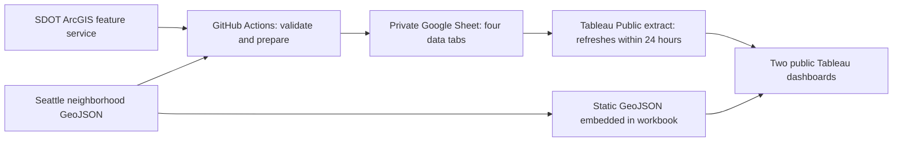

# Tableau Public migration guide

This is the account-bound part of the migration. The repository now prepares,
validates, and publishes the data automatically; the steps below create the
Google and Tableau resources that code cannot create without your accounts.

## Final architecture



There is no Azure dependency. GitHub authenticates to Google Cloud with OpenID
Connect and Workload Identity Federation, so no long-lived cloud key is stored
in GitHub. The Google Sheet can remain private; the published Tableau workbook
is public and exposes the fields imported into its extract.

## 1. Install Tableau on macOS

1. Create a free Tableau Public profile.
2. Download Tableau Desktop Public/Free Edition from
   [Tableau Public](https://public.tableau.com/app/discover).
3. Open the `.dmg`, run the `.pkg`, and finish the installer.
4. Open Tableau and sign in to the profile you will use for publishing.

Tableau documents the current [Public Edition download](https://help.tableau.com/current/desktopdeploy/en-us/desktop_deploy_download.htm)
and [macOS installation steps](https://help.tableau.com/current/desktopdeploy/en-us/desktop_deploy_download_and_install.htm).

## 2. Create the Google Sheet

1. In Google Drive, create a blank spreadsheet named `Seattle Collision Tableau Data`.
2. Copy the spreadsheet ID from its URL. It is the value between `/d/` and `/edit`.
3. Leave the file private. Tableau and the automation identities receive explicit access later.

Do not manually add the production tabs. The first successful workflow creates:

- `FactCollisions`
- `DimNeighborhood`
- `RefreshMetadata`
- `NeighborhoodChange`

## 3. Create the Google Cloud automation identity

1. Open [Google Cloud Console](https://console.cloud.google.com/) and create or select a project.
2. Under **APIs & Services > Library**, enable **Google Sheets API**.
3. Under **IAM & Admin > Service Accounts**, create `tableau-refresh`.
4. Copy its email address, such as `tableau-refresh@PROJECT_ID.iam.gserviceaccount.com`.
5. Return to the Google Sheet, select **Share**, and give that service-account email **Editor** access.
6. Do not create or download a JSON service-account key.

Google Sheet sharing—not a broad Google Cloud project role—grants access to the
spreadsheet. The service account should have access only to this one file.

## 4. Connect GitHub Actions with Workload Identity Federation

Follow Google’s current
[deployment-pipeline federation guide](https://cloud.google.com/iam/docs/workload-identity-federation-with-deployment-pipelines)
and configure these values:

1. Under **IAM & Admin > Workload Identity Federation**, create a pool such as `github`.
2. Add an **OpenID Connect** provider such as `seattle-collision`.
3. Set the issuer to `https://token.actions.githubusercontent.com`.
4. Map `google.subject` to `assertion.sub`.
5. Map `attribute.repository` to `assertion.repository`.
6. Restrict the provider to this repository with the condition
   `assertion.repository == 'GITHUB_OWNER/GITHUB_REPOSITORY'`.
7. Grant this repository principal **Workload Identity User** on the
   `tableau-refresh` service account.
8. Copy the full provider resource name. It must end with
   `/workloadIdentityPools/POOL/providers/PROVIDER` and use the numeric project number.

The checked-in workflow uses Google’s `google-github-actions/auth@v3` action and
requests only `contents: read` and `id-token: write` permissions.

## 5. Add GitHub repository variables

In the repository, open **Settings > Secrets and variables > Actions > Variables**
and add these three repository variables:

| Variable | Value |
|---|---|
| `TABLEAU_GOOGLE_SHEET_ID` | The ID copied from the Google Sheet URL |
| `GCP_WORKLOAD_IDENTITY_PROVIDER` | Full provider resource name |
| `GCP_SERVICE_ACCOUNT` | `tableau-refresh@PROJECT_ID.iam.gserviceaccount.com` |

No GitHub secret is required for cloud authentication.

## 6. Run the first cloud refresh

1. Merge or push the workflow to the repository’s default branch.
2. Open **Actions > Refresh Tableau Public data > Run workflow**.
3. Wait for all steps to pass.
4. Open the Google Sheet and verify that all four tabs exist.
5. Check `RefreshMetadata`: `ValidationStatus` must be `Passed`.

The workflow runs at 6:00 AM `America/Los_Angeles` on the first day of every
month. It first reads the previous row count, downloads current SDOT records,
validates them, then stages and atomically swaps all tabs. A failed run leaves
the previous production tabs unchanged.

The ArcGIS service can contain a small number of records without point geometry.
The pipeline records them as `ExcludedMissingGeometryRows` and excludes them
because they cannot satisfy the coordinate or neighborhood checks. It fails the
refresh if this share exceeds 5%, preventing a large upstream geocoding problem
from being silently published.

## 7. Connect Tableau to the Google Sheet

1. In Tableau, choose **Connect > To a Server > Google Drive**.
2. Sign in with the Google account that owns or can view the spreadsheet.
3. Select `Seattle Collision Tableau Data`.
4. On the Data Source page, name the source `Seattle Collision Data`.
5. Drag `FactCollisions` onto the logical model canvas.
6. Drag `DimNeighborhood`, `RefreshMetadata`, and `NeighborhoodChange` beside it.
7. Create these relationships, not physical joins:

| Left table | Field | Right table | Field | Cardinality |
|---|---|---|---|---|
| `FactCollisions` | `NeighborhoodID` | `DimNeighborhood` | `NeighborhoodID` | Many to one |
| `FactCollisions` | `RefreshKey` | `RefreshMetadata` | `RefreshKey` | Many to one |
| `NeighborhoodChange` | `NeighborhoodID` | `DimNeighborhood` | `NeighborhoodID` | Many to one |

Use referential integrity **Some records match** and keep performance options at
their defaults. All logical tables remain in one Google Drive connection, which
is required for Tableau Public’s automatic Google Sheets refresh.

The old Google Sheets connector is deprecated; use the current
[Google Drive connector](https://help.tableau.com/current/pro/desktop/en-us/examples_googledrive.htm).

## 8. Verify Tableau field types

On the Data Source page, set these types explicitly:

| Field | Type or role |
|---|---|
| `CollisionID`, `NeighborhoodID`, `RefreshKey` | Number (whole) |
| `IncidentDate`, `LatestIncidentDate` | Date |
| `IncidentYear` | Number (whole), then Dimension |
| `Latitude` | Number (decimal), Geographic Role: Latitude |
| `Longitude` | Number (decimal), Geographic Role: Longitude |
| `IsSevere` | Boolean |
| `PipelineRunUtc`, `SourceLastModifiedUtc` | String (preserve the explicit UTC label) |
| Count and score fields | Number (whole) |
| Area and density fields | Number (decimal) |

Sort `OutcomeClass` manually as: No reported injury, Injury, Serious injury,
Fatal. The `OutcomeSort` field is included as a reference.

## 9. Add the static neighborhood polygons

1. Use **Data > New Data Source > Spatial file**.
2. Open `data/tableau/neighborhoods.geojson` from a successful local run or
   download it from the workflow artifact.
3. Name this source `Seattle Neighborhood Geometry`.
4. Keep it separate from `Seattle Collision Data`; mixing a local spatial file
   into the Google Drive source can prevent the automatic Public refresh.

For the Page 2 polygon map:

1. Select `Seattle Neighborhood Geometry` and create a sheet.
2. Double-click `Geometry`, then place `NeighborhoodID` on **Detail**.
3. Choose **Data > Edit Blend Relationships** and link `NeighborhoodID` to the
   same field in `Seattle Collision Data`.
4. In the secondary data source, filter `Keep Change for Comparison Outcome`
   to `True` and default the parameter to `All outcomes`.
5. Put `AnnualDensityChange` on **Color** and the pre/post fields on **Tooltip**.

Tableau supports GeoJSON as a native
[spatial-file source](https://help.tableau.com/current/pro/desktop/en-us/maps_shapefiles.htm).

## 10. Create the calculations and dashboards

Create the fields in [calculated_fields.md](calculated_fields.md), then build the
worksheets and two dashboards in [dashboard_blueprint.md](dashboard_blueprint.md).
Use relationships throughout; do not flatten the four Google tabs with joins.

## 11. Publish and enable refresh

1. Save a local `.twb` or `.twbx` backup.
2. Choose **Server > Tableau Public > Save to Tableau Public**.
3. Use a public-safe title such as `Seattle Vision Zero Collision Dashboard`.
4. In the publish options, allow Tableau to access the Google Drive connection
   for refresh.
5. Open the public visualization in a signed-out/private browser window.
6. In Tableau Public, enable automatic refresh for the Google Sheets source if
   it is not already enabled.

Tableau Public creates an extract and refreshes connected Google Sheets within
24 hours. Tableau assigns the daily refresh window; it cannot be fixed to 8:00
AM. After a manual GitHub run, use **Request Update** in Tableau Public when you
need the visualization refreshed immediately. See the
[Tableau Public refresh FAQ](https://help.tableau.com/current/pro/desktop/en-us/public_faq.htm).

## 12. Validate before replacing Streamlit

Complete [qa_checklist.md](qa_checklist.md) after the initial publication and
after each of the next two monthly refreshes. Keep the Streamlit link available
during this parallel period. Replace the portfolio link and remove the
Streamlit deployment only after two consecutive scheduled refreshes pass.

## Local preparation command

Use the checked-in snapshot while designing the workbook:

```bash
./.venv/bin/python tableau_prep.py \
  --source data/processed/Collision_Processed.parquet \
  --neighborhoods data/processed/Neighborhood_Map_Atlas_Neighborhoods.geojson \
  --output-dir data/tableau
```

Omit `--source` to download the authoritative current ArcGIS data. Generated
files are ignored by Git because they are reproducible and can contain a large
public-data extract.
